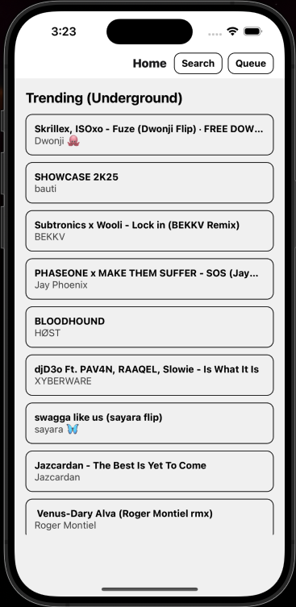
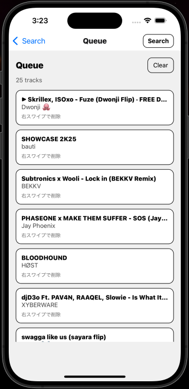

# Audius Player (React Native / Expo)

Audius の公開APIを使って、音源をアプリ内で再生できるシンプルな音楽プレイヤーです。  
**検索 → 再生 → キュー操作**までを最短で実装し、UI/体験も“音楽アプリっぽく”整えました。

> ※ 本アプリはストア配布を目的としていません（ポートフォリオ/学習目的）。

---

## Demo
- iOS Simulator: ✅
- Android Emulator: ✅（任意）

📹 **デモ動画（30秒）**: `docs/demo.mp4`（任意で追加）  
🖼️ スクリーンショット: `docs/screenshots/`

---

## Features
- Trending（Underground）一覧の取得・再生
- 検索（2文字以上）→結果をキューとして再生
- Play / Pause
- Next / Prev（キューに基づく）
- シーク（スライダー + 時間表示）
- Mini Player（常時表示 / 進捗バー）
- Queue画面
  - 一覧表示
  - タップでその曲へジャンプ
  - **右スワイプで削除**
  - Clear（全消し）
- ヘッダー右上から Search / Queue に即移動（UI統一）

---

## Tech Stack
- Expo (React Native)
- TypeScript
- expo-av（音源再生）
- React Navigation（画面遷移）
- TanStack Query（API通信）
- Zustand（Player / Queue 状態管理）
- Audius API（曲取得・検索・ストリーム）

---

## Architecture (Overview)

UI (Screens / Components)
├─ Home / Search / Queue / Player
└─ MiniPlayer

State (Zustand)
├─ queue / index / current
├─ isPlaying / positionMs / durationMs
└─ actions: playAt, toggle, next, prev, seek, enqueue, remove...

Audio Engine (expo-av)
└─ loadAndPlay / pause / resume / seek (+ status updates)

API (Audius)
├─ trending
└─ search

---

## Setup

### Requirements
- Node.js (LTS推奨)
- Expo CLI（`npx expo`でOK）
- iOS Simulator を使う場合：Xcode

### Install
```bash
npm i
```

### Run
```bash
npx expo start
```

- iOS Simulator: i
- Android Emulator: a

---

### Notes / Design decisions
最短で“音が鳴る”ことを優先し、Expo managed + expo-av を採用

キュー操作を Zustand にまとめ、画面間で一貫した操作ができるように設計

UI は「情報の優先順位（アートワーク → 曲情報 → 操作）」に合わせて配置

---

### Future improvements (optional)
バックグラウンド再生 / ロック画面操作

キューの並び替え（ドラッグ）

お気に入り / 再生履歴の永続化

E2E テスト / CI

---

Author
UFO

<GitHub URL（任意）>

---

# 仕上げの“見せ方”セット（これだけやると強い）
## 1) スクショを3枚だけ用意（最小で刺さる）
`docs/screenshots/` に置く（ファイル名はこれがおすすめ）
- `01_home.png`
- `02_player.png`
- `03_queue.png`

---

READMEに貼るなら（GitHubなら相対パスでOK）：
## Screenshots


 